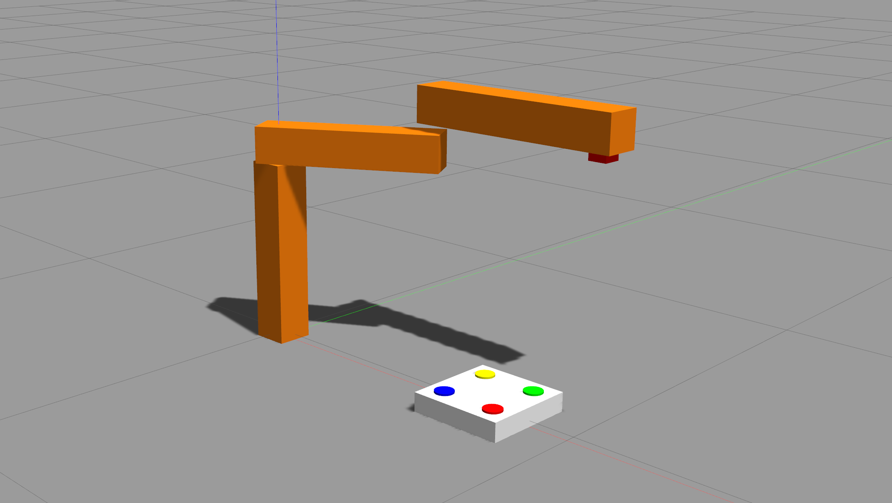

# Visual Servoing using ROS Noetic

## *RBE 450x: Vision Based Robotic Manipulation - Worcester Polytechnic Institute, Fall 2021*

This package spawns a robot with a revolute-revolute joint configuration and an object with certain coloured features. The robot contains a camera at the end effector joint. The goal of the node is to manipulate the Robot in the cartesian space, so that we observe the object move from one location to another in the image space.

Note: This repository is a ROS Package implemented using ROS Noetic and Gazebo 11. Clone this into the `src` folder of your ROS workspace and then build from inside the workspace folder.

